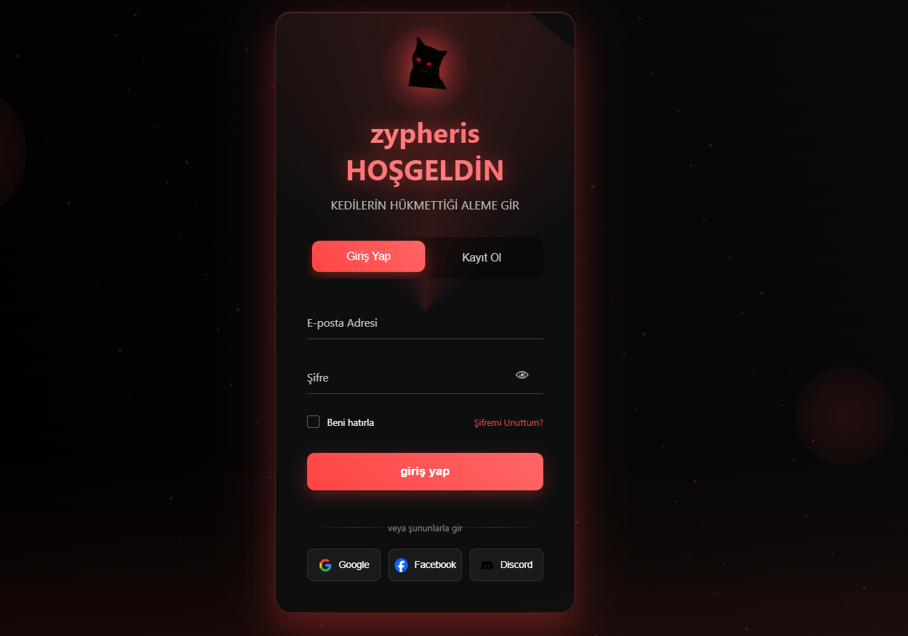
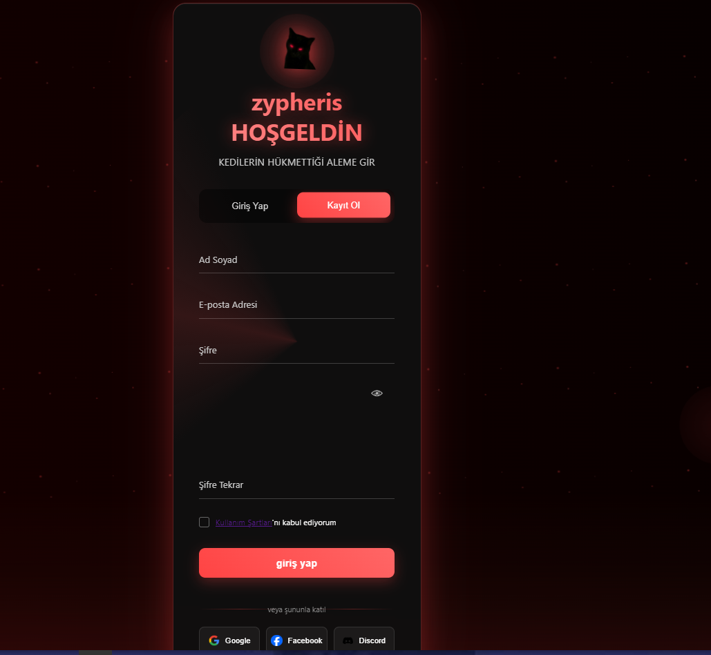

<h1 align="center">✨ Zypheris Giriş & Kayıt Arayüzü ✨</h1>

<p align="center">
  Karanlık temalı, animasyonlu ve şifre analizli şık bir Login/Register UI tasarımı.<br>
  Tamamen HTML, CSS ve JavaScript ile geliştirilmiştir.
</p>

---

<details>
<summary><strong>⚙️ Özellikler</strong></summary>

- Giriş / Kayıt geçişi (animasyonlu)
- 👁️‍🗨️ Şifre göster/gizle
- 🔐 Şifre gücü analiz sistemi
- 💬 Anlık validasyon + hata mesajları
- ✉️ Şifre sıfırlama modal penceresi
- 🔔 Bildirim popup sistemi
- 🌟 Glow + partikül efektleri (butonlarda)
- Modern UI / UX yaklaşımı
- Google, Facebook, Discord giriş ikonları (demo)
</details>

<details>
<summary><strong>📂 Dosya Yapısı</strong></summary>

```plaintext
📁 zypheris-login-ui
├── index.html
├── styles.css
├── script.js
└── images/
    ├── zyp.png
    ├── zyp-eye.png
    ├── google-icon.png
    ├── facebook-icon.png
    └── discord-icon.png

yaml
Kopyala
Düzenle
</details>

<details>
<summary><strong>📸 Önizleme</strong></summary>

| Giriş Ekranı | Kayıt Ekranı |
|-------------|--------------|
|  |  |
</details>

---

## 🔒 Uyarı

> - Bu arayüz statiktir; arka uç (backend) doğrulama sistemi içermez.  
> - Sosyal medya giriş butonları sadece örnek davranış sergiler.
